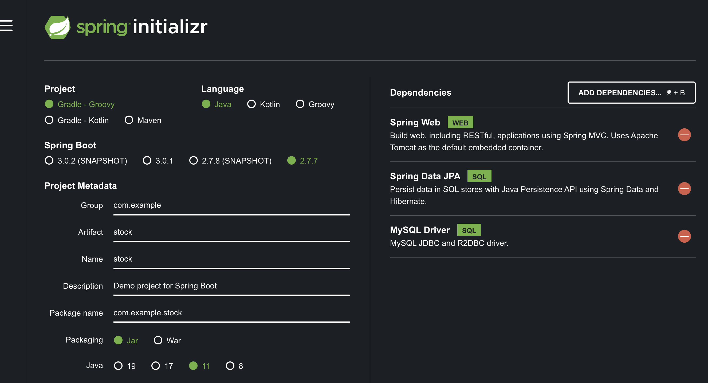

## 왜 NamedLock 을 사용해야하는가 ?

보통 분산락이라는 키워드로 검색을 해보면 레디스가 많이 나오는데요, MySQL lock 을 사용해서도 분산락을 구현할 수 있어요! 레디스를 사용하려면 인프라 구축 비용도 들고, 비지니스 로직 또한 별도로 구축해주어야하기 때문에 바용이 꽤 크다고 볼 수 있어요. 만약 지금 MySQL 을 사용하고 있다면, **이름으로 Lock 을 지정**해줄 수 있는 네임드 락을 이용해서 분산락을 구현하면 **어플리케이션 단에서 제어가 가능**하고, **인프라 구축 및 유지보수 비용도 줄일 수 있습니다!** 

## NamedLock 사용 방법

직접 MySQL 키워드를 사용하여 LOCK 을 획득하면 됩니다.  저희는 네이티브 쿼리를 사용해서 획득하고 싶은 락에 대한 이름을 매개변수로 넘겨주어 락을 구현해보겠습니다. 

## STEP 1) 락 획득하기

```java
public interface LockRepository extends JpaRepository<Stock, Long> {

	@Query(value = "select get_lock(:key, 3000)", nativeQuery = true)
	void getLock(String key); // 이부분!

}
```

- **GET_LOCK(str,timeout)**
    - 입력받은 이름(str) 으로 timeout 초 동안 잠금 획득을 시도합니다. timeout 에 음수를 입력하면 잠금을 획득할 때까지 무한대로 대기하게 됩니다.
    - 한 session에서 잠금을 유지하고 있는동안에는 다른 session에서 **동일한 이름의 잠금을 획득 할 수 없습니다.**
    - `GET_LOCK() 을 이용하여 획득한 잠금은 Transaction 이 commit 되거나 rollback 되어도 해제되지 않습니다.`
    - **GET_LOCK() 의 결과값은 1(성공), 0(실패), null(에러발생) 을 반환**합니다.
    - **MySQL 5.7 이상 버전과 5.7 미만 버전의 차이**
    
    | 5.7 미만 | 5.7 이상 |
    | --- | --- |
    | 동시에 하나의 잠금만 획득 가능 | 동시에 여러개 잠금 획득 가능 |
    | 잠금 이름 글자수 무제한 | 잠금 이름 글자수 60자로 제한 |
    - MySQL 5.7 이전 버전에서 GET_LOCK() 을 이용하여 동시에 여러개의 잠금을 획득하게 되면, 이전에 획득했던 잠금이 해제되게 됩니다.
    - 동시에 잠금을 획득하기위해 대기할 때 대기 순서는 보장되지 않습니다.

## STEP 2) 락 반납하기

```java
public interface LockRepository extends JpaRepository<Stock, Long> {

	@Query(value = "select get_lock(:key, 3000)", nativeQuery = true)
	void getLock(String key); 

	@Query(value = "select release_lock(:key)", nativeQuery = true)
	void releaseLock(String key);// 이부분!
}
```

- **RELEASE_LOCK(str)**
    - 입력받은 이름(str) 의 **잠금을 해제**합니다.
    - RELEASE_LOCK() 의 **결과값은 1(잠금해제 성공), 0(현재 스레드에서 획득한 잠금이 아님) ,null(잠금 없음) 을 반환합니다.**

해당 락은 `스레드가 종료된다고해서 자동으로 락이 반납되는게 아니기 때문에` 꼭꼭꼭 락을 반납해줘야합니다. 

## ETC) 락 관련된 다른 함수들

그 외에도 락이 있는지 확인하거나 사용중인지 확인하는 기타 함수들이 있습니다. 

- **RELEASE_ALL_LOCKS()**
    - 현재 세션에서 유지되고 있는 모든 잠금을 해제하고 해제한 잠금 갯수를 반환합니다.
- **IS_FREE_LOCK(str)**
    - 입력한 이름(str)에 해당하는 잠금이 획득 가능한지 확인합니다.
    - 결과 값으로 1, 0, null 을 반환합니다.
    - 1 : 입력한 이름의 잠금이 없을때
    - 0 : 입력한 이름의 잠금이 있을때
    - null : 에러발생시(ex : 잘못된 인자)
- **IS_USED_LOCK(str)**
    - 입력한 이름(str)의 잠금이 사용중인지 확인합니다.
    - 입력받은 이름의 잠금이 존재하면 connection id 를 반환하고, 없으면 null 을 반환합니다.

---

## 프로젝트 구축 방법

[https://start.spring.io/](https://start.spring.io/) 에서 아래와 같이 설정을 한 후, 생성을 눌러 프로젝트 파일을 만듭니다! 이번 학습에서는 스프링과 JPA 를 사용할 예정입니다. 





### 1️⃣ 사용할 도메인(재고)  구현

재고 시스템을 구축해보면서 학습을 할 에정이기 때문에 재고를 차감할 수 있는 간단한 비지니스로직을 포함한 엔티티를 생성합니다. 

```java
@Entity
public class Stock {

	@Id
	@GeneratedValue(strategy = GenerationType.IDENTITY)
	private Long id;
	
	private Long productId;

	private Long quantity;

	public Stock() {
	}

	public Stock(Long productId, Long quantity) {
		this.productId = productId;
		this.quantity = quantity;
	}

	public void decrease(Long quantity) {
		if (this.quantity - quantity < 0) {
			throw new RuntimeException("차감할 재고가 없습니다.");
		}
		this.quantity = this.quantity - quantity;
	}
}
```

### 2️⃣ 간단한 JPA Repository

```java
public interface StockRepository extends JpaRepository<Stock, Long> {

}
```

### 3️⃣ 비지니스를 담당할 Service

```java
@Service
public class StockService {
	private StockRepository repository;

	public StockService(StockRepository repository) {
		this.repository = repository;
	}

	@Transactional(propagation = Propagation.REQUIRES_NEW) // 왜 새로운 트랜잭션을 열까?
	public void decrease(Long id, Long quantity) {
		final Stock stock = repository.findById(id).get();

		stock.decrease(quantity);

		repository.saveAndFlush(stock);
	}
```

### 4️⃣ 락을 얻고 반납하기 위한 추가 Repository 구현

네이티브 쿼리로 직접 락 설정을 해줘야해요. 락의 이름과 해당 락의 timeout 시간을 설정합니다. 

해당 락은 최대 timeout 시간까지 점유하고 있을 수 있어요. 

```java
public interface LockRepository extends JpaRepository<Stock, Long> {

	@Query(value = "select get_lock(:key, 3000)", nativeQuery = true)
	void getLock(String key);

	@Query(value = "select release_lock(:key)", nativeQuery = true)
	void releaseLock(String key);

}
```

### 5️⃣ Facade 패턴으로 Lock 을 걸고 반납하는 로직을 구현

해당 로직으로 퍼사드 패턴으로 구현한 이유는 건물의 뼈대처럼 락을 걸고 반납하는 로직 외에 해당 클래스는 모르게 캡슐화 하고 싶었어요. 

```java
@Component
public class NamedLockStockFacade {

	private LockRepository repository;
	private StockService stockService;

	public NamedLockStockFacade(LockRepository repository, StockService stockService) {
		this.repository = repository;
		this.stockService = stockService;
	}

	@Transactional
	public void decrease(Long id, Long quantity) throws InterruptedException {
		try {
			repository.getLock(id.toString());

			stockService.decrease(id, quantity);
		} finally {
			repository.releaseLock(id.toString());
		}
	}
}
```

### 6️⃣ 동시성 테스트 해보기

우선 가상 상황을 만들어보자면, 100개의 재고가 있는 상품에 대해서 100명이 동시에 요청이 들어왔을 때 정상적으로 100개의 재고가 0로 변경되는 것이 보장되는가에 대한 테스트를 진행하고 싶었어요. 

그래서 before 에 재고가 100개인 스탁을 하나 만들어요. 그리고 100개의 쓰레드를 만든 다음  `countDownLatch` 를 사용해서 100개의 쓰레드가 한꺼번에 실행할 수있도록 대기 상태를 만듭니다. `countDownLatch.await()`  count 가 0이 될 때까지 대기했다가 0이 되면 한꺼번에 실행시킵니다! 

```java
@SpringBootTest
class NamedLockStockFacadeTest {
	@Autowired
	private NamedLockStockFacade stockService;

	@Autowired
	private StockRepository stockRepository;

	@BeforeEach
	public void before() {
		final Stock stock = new Stock(1L, 100L);
		stockRepository.save(stock);
	}

	@AfterEach
	public void after() {
		stockRepository.deleteAll();
	}

	@Test
	void consistenceProblem() throws InterruptedException {
		int threadCount = 100;

		final CountDownLatch countDownLatch = new CountDownLatch(threadCount);
		//비동기로 실행하는 것을 단순화해서 사용할 수 있게 해줌
		final ExecutorService executorService = Executors.newFixedThreadPool(32);
		for (int i = 0; i < threadCount; i++) {
			executorService.submit(() -> {
				try {
					stockService.decrease(1L, 1L);
				} catch (InterruptedException e) {
					throw new RuntimeException(e);
				} finally {
					countDownLatch.countDown();
				}
			});
		}
		countDownLatch.await();
		final Stock stock = stockRepository.findById(1L).get();

		Assertions.assertEquals(stock.getQuantity(), 0L);
	}
}
```

## 왜 Required new 로 Named Lock 을 걸어야할까?

락을 얻은 커넥션에서만 락을 반납할 수 있는데, **DB에 쿼리를 실행하는 커넥션과 락을 점유한 커넥션이 같다면?** 쿼리가 종료되고 커밋되면 커넥션이 반납되는데 이 과정에서 락이 반납되지 않을 수도 있고, **락을 반납할 때 락을 얻은 커넥션과 반납하는 커넥션이 달라서 락 반납이 안되는 문제도 생길 수 있어요**. 또한 락을 얻는데 문제가 생기면 해당 문제가 재고 차감을 하는 로직에 영향을 주기 때문에 두 로직을 분리할 필요성을 느꼈어요. 그래서 락에 관련된 작업을 할 때는 새로운 커넥션을 열어서 해당 커넥션은 말 그래도 락을 얻고, 반납하는 용도로만 사용하고 싶어서 트랜잭션 전파레벨을 `required new` 로 해줍니다. 

## Select For Update 로 대신할 수는 없을까??

현재 하고 싶은건 해당 재고 차감 작업을 할 때 다른 스레드와 작업 내역을 동기화하고 작업 내역에 대한 갱신이상이 발생하지 않도록 보장하는 것입니다! 그러면 비슷한 기능을 하는 select for update 명령어를 사용해서 구현할 수는 없을까 궁금해졌어요. 그리고 찾아보니 두가지 방법 중 namedLock 이 해당 문제를 해결하기 조금더 적합한 이유에 대해서 알게 되었는데요. select for update 는 timeout 설정이 까다로워서 락을 얻지 못하면 바로 종료시키거나, Lock 을 얻을 때까지 무한 루프에 빠지게 되는 문제가 발생할 수 있다는 점을 알게 되었어요. 그래서 `get_Lock(”락이름”, “타임아웃 시간”)` 으로 무한 루프를 대비하여 문제를 예방하는 로직이 필수적이라는 사실도 알게 되었습니다. 

## 언제 MySQL named-lock 을 쓰면 좋을까?

우선 단일 WAS 환경에서 보다는 **다중서버 환경에서 데이터 동기화, 정합성이 요구되는 상황이고, 인프라 구축 비용이 부담된다면 MySQL 네임드 락을 사용해서 분산환경을 구축하는것도 좋은 선택인 것 같아요**. 다만 락에 대한 획득 반납에 대한 로직이 철저하게 지켜져야하고, 해당 로직에 대한 설명 또한 javaDoc 이나 wiki 로 히스토리를 남겨두어 추후 인프라가 변경되었을 때 해당 로직에 대한 리팩터링 가능성에 대해서도 코멘트 남겨주면 좋을 것 같아요. 

## 느낀점

분산락을 추가적인 인프라없이 구축할 수 있다는 점이 신기했고, 해당 락을 선점하는 과정에서 timeout 이 왜 필요할까 궁금했는데 동시 요청이 들어왔을 때 만약 데드락 상황이나 락을 점유할 수 없는 상황에 대한 이른 실패에 대한 로직이 구축되어 있어야 프로그램의 빠른 회복을 돕고, 혹은 다른 시도를 해볼 수 있는 상황을 만들수 있다는 것을 알게 되었습니다! ㅎㅎ 항상 트레이드 오프를 생각하고 학습을 해야 더욱 더 견고한 프로덕트를 만들 수 있을 것 같아요 너무 재밌었습니다. 

---

## 참고

- [분산락 우아한형제들 기술 블로그](https://techblog.woowahan.com/2631/)
- [CountDownLatch](https://imasoftwareengineer.tistory.com/100)
- [퍼사드 패턴](https://gdtbgl93.tistory.com/142)
- [재고 시스템으로 알아보는 동시성 이슈](https://www.inflearn.com/course/%EB%8F%99%EC%8B%9C%EC%84%B1%EC%9D%B4%EC%8A%88-%EC%9E%AC%EA%B3%A0%EC%8B%9C%EC%8A%A4%ED%85%9C#curriculum)