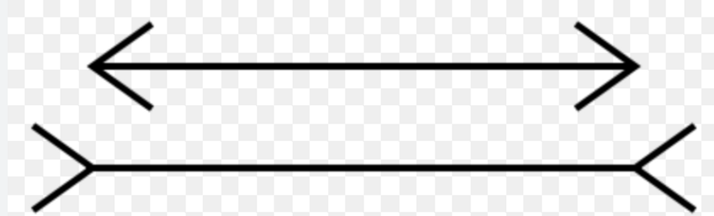
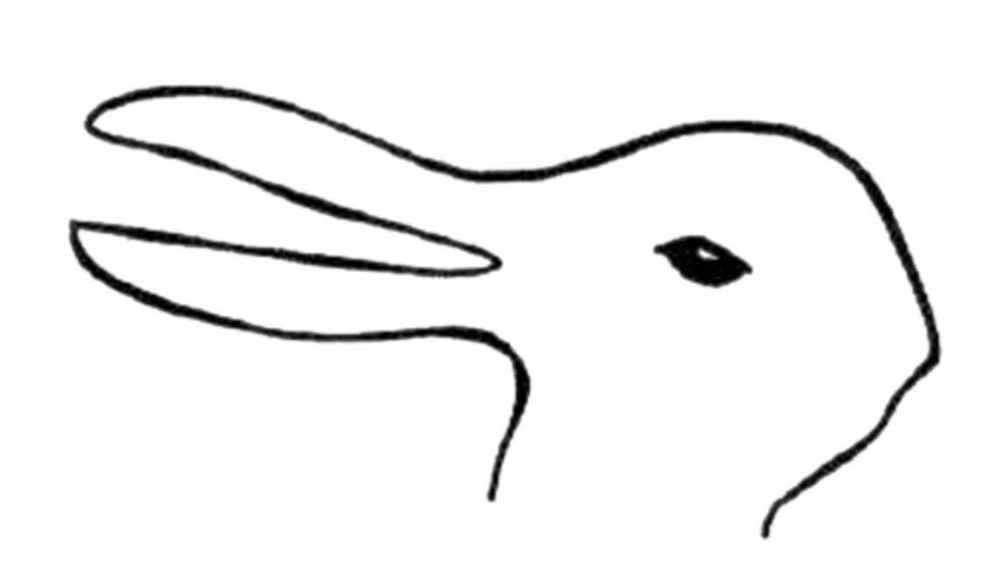

## 아름다움.

아름답기 때문에 사랑하는 것일까, 사랑해서 아름다워 보이는 걸까? 사랑하는 사람이 전화를 하거나 말을 하는 모습을 보면서 우리는 왜 이 목의 곡선이나 보조개가 매력있게 다가오는지 묻게 된다. 

**사랑은 아름다움에 욕망이라는 마르실리오 피치노라는 이탈리아 철학자**의 말이 맞다면, 내가 사랑하는 사람은 어떤 방식으로 나의 욕망을 충족시킬까? 

아름다움은 객관적인 기준에 따라서 측정할 수 있는걸까. 우리가 잘생기고 예쁘다고 생각하는 사람들의 얼굴에는 수학적 기초가 담겨있다. 따라서 잡지 표지 모델에 얼굴이 즐거움을 주는 것은 우연이라기보다 필연이다. 

플라톤과 레온 바티스타 알베르티는 그들의 미학 이론에서 뭔가를 빠트린것이 틀림 없다. 나는 내가 사랑하는 사람이 지나치게 아름답다고 생각했기 때문이다. 내가 그의 보조개와 짙은 눈썹을 좋아했던 것일까?  그 사람의 매력 요소를 뽑는것이 명확하게 어떤 특징 때문이 아니라서 망설여진다. 

그림을 볼 때도 어떤 그림은 내게 완벽한 감동을 주는 반면, 아무 감흥이 없는 그림도 있다. 이것을 우리는 어떻게 설명할 수 있을까? 

내가 묘사할 수 있는 것은 아름다움이 아니라, 그 사람에 대한 나의 주관적인 반응 뿐이다. 아름다움은 객관적 기준이라는 플라톤적 관념을 배격하고 **대신 미학적 판단은 결정 근거가 주관적일 수 밖에 없다는 칸트의 판단력 비판**에 나오는 견해에 동조할 수 밖에 없다. 

 

### 뮐러 리어 착시 현상

이런 상황은 뮐러-리어의 착시와 비교될 수 있다. 이 착시에서는 길이가 똑같은 두 선이 끝에 다른 화살표가 붙어있다는 것 만으로도 길이가 다르게 보인다. 내가 상대방을 바라보는 애정 어린 눈길은 밖으로 연린 화살표와 같은 역할을 했다. 그런 화살표가붙으면 평범한 선도 객관적인 측정치와 관계 없이 길어보인다. 

스탈당이 말하길 아름다움은 행복의 약속이다.  실제 그의 얼굴이 내가 생각하는 좋은 삶과 동일시 하는 특징을 가지고 있었다. 그의 코는 유머가 있었고, 빨개지는 귀는 순수했고 자주 보여주는 보조개는 긍정적인 태도를 암시했다. 

완벽함을 추구하는 것에는 어떤 압제가 있다. 심지어 어떤 실증이 느껴진다. 과학적 공식과 같은 힘으로 자신을 내세우는 것 같기 때문이다. 수학적 비율이 주는 편안함에 안주하지 않고, 내 감정에 맞추어 아름다움이 좌우된다면 그게 더 재미있지 않을까? 

고전적으로 아름다운 사람은 내게 상상력의 여지를 남기지 않는다. 

 

### 상상력에 따라 달라지는 해석

비트겐 슈타인의 오리 그림은 상상력에 따라서 토끼가 보이기도 한다. 중요한 것은 보는 사람의 경향이다. 나의 영혼으로 상대방에게 생기를 불어 넣었던 것이다. 보는 사람의 관점에서 아름다움을 찾는다면, 보는 사람이 시선을 거둘 때 어떤 일이 벌어질까? 그러나 어쩌면 그것 역시 삶이 주는 매력의 한 부분이었는지도 모른다. 그리고 아름다움에 관한 주관적 이론은 내가 사랑하는 사람을 없어서는 안될 존재로 만들어 버리므로. 

 

## 내가 개발을 사랑하는 이유

왜 개발자가 되려고 하세요? 라는 질문에 대답을 한참 망설였던 적이 있다. 이전에는 과정-결과가 명확해 이걸 맞추면 성취감이 들어서라고 대답했다. 위 챕터를 읽은 지금은 “내가 한 주관적 선택들이 코드에 쌓여 있어 내가 아름답다고 느끼거나, 소중하다고 생각되기 때문에” 라고 대답하고 싶다. 
