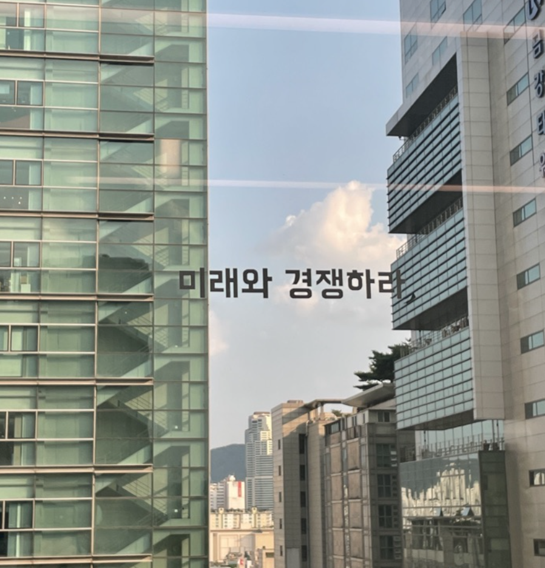

## intro 😃
> 새해를 맞이해서 지난 1년간 어떤 일을 했는가 돌아보다보니 성취한 것들에 대한 내용들만 적게 되더라고요. 그래서 오늘은 스스로가 어떤 성격이고, 왜 이런 성격을 가지게 되었는지 살펴보고자 합니다. 

## **episode 1:  뻔(fun)하다.**

> 어릴 때부터 짱구처럼 오늘은 또 어떤 재밌는 일이 나를 기다릴까 기대하며 하루를 시작해요. 하루에도 여러번 피식하고 웃음이 나는 일이 있거든요. 그런 순간이 언제인지 그 타이밍이 오면 웃음을 놓치지 않고 누구보다 음미하면서 웃으려고 노력하는 성격이에요. 웃음 소리가 너무커서 가끔 주변 눈치를 보기도 하는데, 이런 순간들이 삶을 살아가게 하는 것 같아요. 

첫번째로 음악을 통해 많이 웃는 것 같아요. 요새 취미가 **산책하면서 노래부르기인데, 노래를 따라 부르다보면 스트레스도 풀리고, 노래 가사에 알맞는 상황에서 딱 그 구절을 부르고 함께 있는 상대방의 반응을 살피면 너무 웃겨요.** 그래서 많이 웃게 돼요. 

또 진지한 상황에서 위트있게 풀어가려는 노력도 많이 하는 편이에요. 문제를 너무 심각하게 바라보면 끝이 없거든요. 결론을 내려야하는데, 조금 더 나은 결론을 내기 위해서는 무거운 감정을 살짝 내려놓고 이성적으로 바라보는 노력이 필요하다고 생각해요. 그래서 분위기를 환기 시키는 용도로 농담을 즐기곤 합니다. 

이런 성격이 형성된 기저에는 웃음이 많은 사람들 속에서 자라며  웃음이 주는 긍정적인 경험들이 있어요. 이 글을 읽는 여러분 모두 자주 웃고 자주 행복을 느끼세요 ❤️

 

## **episode 2: 릴리즈(release) 하다**

> 스트레스를 받으면 운동을 하거나 책을 읽어요. 내 몸에 움직임이나, 글에 집중하다보면 잡생각이 사라지고,  스트레스 받은 원인에 대해서 감정을 배제하고 생각할 수 있거든요.  해결 방법에 대한 인사이트를 책을 통해서 얻기도 하고, 왜 스트레스를 받고 있는지 스스로 질문해보며 기분이 전환됨을 느낄 때 좋더라고요! 

그런 맥락에서 글쓰기도 좋아해요. 글쓸 때는 엄청나게 집중해야해요. 그래서 잡생각이 안나서 좋아요. 글을 쓰기 시작할 때 막막함이 글을 다 쓴 뒤 성취감으로 다가오는 점도 좋아요. 제 글이 누군가에게 닿아 위로가 되고, 도움이 될 때 뿌듯하더라고요. 또 사진보다 그때의 내 감정과 생각들을 더 생생히 담아둘 수 있다는 점이 매력적으로 느껴져요. 

요새 [블로그](sudal.site)를 시작했어요. 제가 책을 읽고 느끼는 감정이나, 최근에 내 생각, 개발을 하며 알게된 인사이트들을 생생히 담고 싶어요. 

 

## **episode 3: 런(learn) 하다.**

> “남들이 보는 나는 어떨까?” 라고 고민하던 시기가 있었어요. 그 때 제가 가장 소중하게 생각하는 분께서 **가치판단의 무게중심을 외부에 두지 말고, 내부에 두면 어떤 상황이든 흔들리지 않는 편안함을 가질 수 있다**고 조언해주셨어요. (시몬스 침대 아님) 

그래서 저는 어제보다 나은 나와 경쟁하기로 했어요. 최근에는 데일리 기상 스터디를 열어서 하루를 조금 더 체계적으로 살기 위해 노력하고 있어요. 또 두개의 책 스터디에 가입해서 매주 책 읽기를 강제하고 있어요. 의지보다 더 강력한건 그렇게 할 수 밖에 없는 환경을 조성하는 것임을 우아한테크코스를 수료하며 느꼈거든요. 거기서 알게 된 사람들과 함께 더 나은 삶을 도모하며 보내는 하루 하루가 재밌어요. 

## the present :

스스로를 돌보는 일이 중요한지 알면서도 잘 못하는 일인 것 같아요. 글을 적다보니 스스로를 잘 모르고 있었구나 싶었어요.  새해에는 이렇게 나에 대해서 자주 궁금해하고, 알아가려고 노력하는 시간을 가져야겠다고 느꼇습니다. 새해에는 더 즐겁게 소통하는 법을 배우고 나누기 위해 글또라는 대외활동을 시작하려고 합니다. ✨ 앞으로 더욱더, 자주 제 생각을 나누도록 노력할게요. 오늘도 행복하세요!