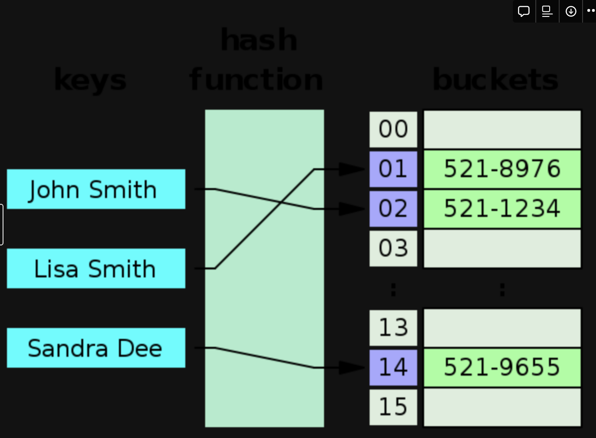

## 학습 동기

중복되지 않는 값을 가진 데이터를 빠르게 조회하고 싶었어요. 그리고 그 값에 대한 개수를 세고 그 개수에 대한 로직을 작성하고자 했습니다. 그러던 중 해시 함수를 이용해서 테이블에 데이터 Key - value 형식으로 저장하는 HashMap 이 떠올랐어요. HashMap 내부는 Hash table 로 구현되어 있기 때문에 Hash table 에 대해서 먼저 알아보면 좋을 것 같습니다. 

## HashTable

해시 테이블은 연관배열 구조를 이용해서 키(key) 에 결과값에 (value) 를 저장하는 자료 구조 입니다! 



### 저장 시간 복잡도

데이터가 입력되면 해당 해시함수 로직을 통해서 고유 번호(해시값)가 나오게 되고, 그 고유번호를 key 로 가지고, 실제 데이터(value) 를 slot 이라고 부르는 공간에 넣게 돼요. 그래서 최단 시간 복잡도는 O(1) 이고, 만일 충돌이 발생하게 되면  최대 O(n) 의 시간이 걸릴 수도 있어요.😭

### 충돌이 발생하는 경우

- key 값이 같고, value 가 다른 경우
    (HashMap 기준으로 설명)
    이 경우는 key 값이 있는 슬롯을 찾아서 가장 먼저 실제 key 데이터가 같은지 확인하고 같다면 value 를 업데이트 해줘요. 그래서 key 가 고유함을 보장할 수 있어요. 
    
- key 값이 다른 경우
    해쉬함수를 사용해서 해쉬를 만들경우 key 값이 다르지만, 동일한 해쉬가 나올 경우도 있어요. 그럴 때 해결 방법이 2가지 있습니다. 
    
    - **개방 주소법(Open Addressing)**
        
        충돌 난 다음 슬롯에 저장하기, 제곱만큼 건너 뛴 슬롯에 저장하기, 다른 해시 함수를 한번 더 적용한 겨로가를 저장하기 방식이 있습니다. 
        
        - 지정한 메모리 외에 추가적인 공간이 필요 없고, 삭제시 오버헤드가 적어요!, 최악 일 때는 데이터를 찾지 못할 수도 있고, 특정 위치에 데이터가 몰릴 수도 있습니다.
    - **체이닝(Close Addressing)**
        
        각각의 버킷을 연결 리스트를 사용하여 만들어 데이터를 연결하는 방식이 있어요. 
        
        - 삽입, 삭제가 간단해요!
        - 추가적인 메모리를 사용해요 (데이터 크기가 작다면, 적은 데이터를 사용할 때 메모리 낭비가 심해요)
        

### 조회 시간 복잡도

key 를 해시함수를 사용해서 데이터를 변환한 뒤에 해당 슬롯으로 바로 접근하면 value 를 찾을 수 있어요!  최단 시간은 **O(1) 의 시간 복잡도를 가지게 됩니다.** 만약 충돌이 발생해서 다른 위치에 저장되어 있다면 **최대 O(n)** 까지의 시간 복잡도를 가질 수도 있어요. (삽입시와 유사한 알고리즘을 가지고 있습니다! )

## Hash Map vs Hash Set

우선 HashMap 과 HashSet 모두 HashTable 을 기반으로한 동작 원리를 가지고 있어요. 간단한 차이는Set 은 value 에 값 하나만 있지만,  Map 은  데이터에도 key- value 를 가지고 있다는 점입니다.

### Hash Set 내부 구현이 Hash Map  이라고?

동작원리가 궁금해져 코드를 직접 살펴봤더니 HashSet 이 HashMap 을 통해 생성되어 있었습니다.

왜그럴까요? 

제 생각에는 HashSet 또한 중복값을 허용하면 안되기 때문에 값에 대한 내역을 효율적으로 관리하고 싶었던 것 같습니다. 

그래서 삽입시 공통 값인 Present 를 넣어두고 삭제 시에 반환되는 값이 Present 이면 정상적으로 삭제 되었다고 판단하는 형태의 로직을 구현해두었던 것 같아요. 기존 로직을 재활용한  좋은 사례인 것 같습니다. 

```java
public HashSet() {
   map = new HashMap<>();
}

public boolean add(E e) {
   return map.put(e, PRESENT)==null;
}

public Iterator<E> iterator() {
    return map.keySet().iterator();
}

public boolean remove(Object o) {
    return map.remove(o)==PRESENT;
}
```

## 언제 HashMap 을 사용하면 좋을까요?

- 영화 제목 - 가격처럼 `key - value 관리가 필요할 때`
    
    중복이 제거되고, 최소 O(1) 의 시간 복잡도를 가지고 있기 때문에 효율적인 구현이 가능해요
    
- 영화 제목 - 누적 관람객 수처럼 `특정 데이터에 대한 count 가 필요할 때`
    
    해당 객체에 바로 접근이 가능해서 연산 작업을 하기 수월해요. 
    

### 유용한 메서드 `getOrDefault`

만약 count 를 하고 싶다면? 동일한 key 값에 데이터가 있으면 그 데이터 +1 을 해야하고, 그렇지 않으면 기본 값인 1 을 넣어줘야할 거예요. 그럴 기본 값을 설정할 수 있는 getOrDefault 메서드가 있어요! 

```java
default V getOrDefault(Object key, V defaultValue) {
        V v;
        return (((v = get(key)) != null) || containsKey(key))
            ? v
            : defaultValue;
    }
```

## 느낀점

해시는 중복을 줄이고, 데이터를 최대한 빠르게 탐색하기 적합한 자료구조라는 것을 알았어요. JAVA 에서 이런 문제를 해결하기 위한 고민들이 있었다는 사실이 너무 재밌었습니다. 

## 참고

- [해시 충돌](https://javannspring.tistory.com/238)
- [hashSet 동작 원리](https://www.blog.ecsimsw.com/entry/%EC%9E%91%EC%84%B1-%EC%A4%91-%EC%9E%90%EB%B0%94-HashSet%EC%9D%98-%EC%9B%90%EB%A6%AC)
- java 실제 코드
- [Hash, Hashing, Hash Table(해시, 해싱 해시테이블) 자료구조의 이해](https://velog.io/@cyranocoding/Hash-Hashing-Hash-Table%ED%95%B4%EC%8B%9C-%ED%95%B4%EC%8B%B1-%ED%95%B4%EC%8B%9C%ED%85%8C%EC%9D%B4%EB%B8%94-%EC%9E%90%EB%A3%8C%EA%B5%AC%EC%A1%B0%EC%9D%98-%EC%9D%B4%ED%95%B4-6ijyonph6o)