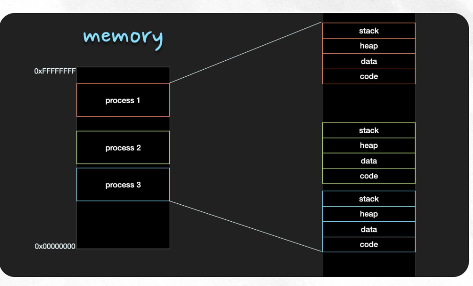
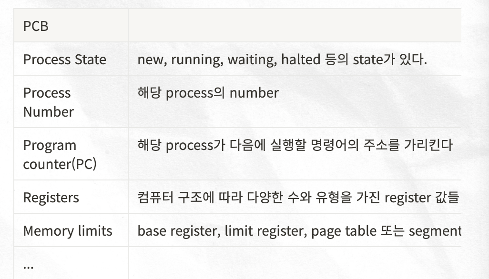

프로세스와 스레드를 학습하기에 앞서, 이해하고 있으면 좋은 개념인 CPU 와 RAM 에 대해서 간단히 알아보아요! ☺️

### CPU란? (core processing unit)
중앙 처리 장치로 컴퓨터를 통한 연산과 수행, 프로그램 실행을 담당하고 있어요
CPU 는 출력을 전달하기 전에 RAM 에서 입력을 가져와 명령문을 이해하고 처리합니다. 

### RAM란?(Random access memory)
프로그램이 실행되는 동안 필요한 정보를 저장하는 컴퓨터 메모리 RAM 이란 저장된 데이터를 순차적이 아닌 임의의 순서로 액세스할 수 있는 데이터 저장소입니다.

- 데이터를 가져오기, 디코딩, 실행이 세가지가 cpu 의 핵심이자 전부에요!

> ## 프로세스(Process)
프로세스란 실행중인 프로그램을 뜻합니다. 즉, 파일 형태로 존재하던 프로그램이 메모리에 적재되어 CPU 에 의해 실행되는 것을 Process 라고 합니다.

### 메모리에 적재

메모리는 CPU가 직접 접근 할 수 있는 컴퓨터 내부의 기억 장치 입니다. Program이 CPU에서 실행되려면 해당 내용이 memory에 적재된 상태여야만 합니다. 

프로세스에 할당되는  공간은 code, data, stack, heap 4개 의 영역으로 이루어져 있으며, 각 Process 마다 독립적으로 할당 받습니다. 

| code 영역 | 실행한 프로그램의 코드가 저장됨 |
| --- | --- |
| data 영역 | 전역 변수와 static 변수가 저장 |
| heap 영역 | 프로그래머가 직접 할당, 해제 하는 공간 |
| stack 영역 | 함수 호출시 생성되는 지역변수와 매개변수가 저장 |

## CPU의 연산과 PC regisgter

프로그램 코드를 토대로 CPU가 실제로 연산을 해야만 프로그램이 실행된다고 볼 수 있어요. 어떤 코드를 읽어야하는 것을 정하는 것은 CPU 내부에 있는 PC(program counter) register 에 저장되어 있습니다.  여기에는 다음에 실행될 코드의 주소값이 저장되어 있는데요.  즉 메모리에 code 영역의 명령중 다음번 연산에서 읽어야할 명령어의 주소값을 PC register가 순차적으로 가리키게 되고, 해당 명령어를 읽어와서 CPU 가 연산을 시작하면 프로세스가 되는 것 입니다!

## 멀티 프로세스 vs 멀티 스레드

멀티 프로세스란 2개 이상의 프로세스가 동시에 실행되는 것을 말합니다. 동시에라는 말은 동시성과 병렬성 두가지를 의미합니다.

`동시성`은 CPU core 가 1개일 때, 여러 process를 짧은 시간동안 번갈아 가면서 연산을 하게되는 `시분할 시스템`으로 실행되는 것`병렬성`은 CPU core 가 여러개일 떄 `각각의 core 가 각각의 Process`를 연산함으로써 Process가 동시에 실행되는 것입니다. 
동시성은 실제로는 하나의 작업만 이뤄지는데 동시에 처리되는 것 같이 보이는 것을 의미하고, 병렬성은 실제로 여러 코어가 여러 작업을 실행하고 있는 것을 의미합니다. 

### 멀티 프로세스

멀티 프로세스란 2개 이상의 프로세스가 동시에 실행되는 것을 말합니다 이 때 `프로세스들은 CPU 와 메모리를 공유`하게 됩니다. 
메모리의 경우에는 여러 프로세스들이 각자의 메모리 영역을 차지하여 동시에 적재됩니다. 반면 하나의 CPU 는 매순간 하나의 프로세스만 연산할 수 있습니다. 하지만 CPU의 처리 속도가 워낙 빨라서 수ms 이내의 짧은 시간동안 여러 프로세스들이 CPU에서 번갈아가며 실행되기 때문에 사용자 입장에서는 여러 프로그램이 동시에 실행되는 것 처럼 보입니다.

이처럼 CPU의 작업 시간을 여러 프로세스들이 조금씩 나누어 쓰는 시스템을 `시분할 시스템`이라고 부릅니다.

### 메모리 관리

여러 프로세스가 동시에 메모리에 적재된 경우, 서로 다른 프로세스의 영역을 침범하지 않도록 각 Process가 자신의 메모리 영역에만 접근하도로 운영체제가 관리해줍니다. 

### CPU의 연산과 PC 레지스터

CPU는 PC register가 가리키고 있는 명령어를 읽어들여 연산을 진행합니다. pc register 에는 다음에 실행될 명령어의 주소값이 저장되어 있어요. 멀티 프로세스 시스템에서는 `프로세스1 이 실행`되고 있을 때는 `프로세스1의 code 영역을 pc register`가 가리키다가, `process2가 진행되면` `prcess2의 code 영역을 가리키게 된다.` CPU는 PC register가 가리키는 곳에 따라 process를 변경해 가면서 명령어를 읽어들이고 연산하게 됩니다.

## Context

시분할 시스템에서는 한 프로세스가 매우 짧은 시간동안 CPU 를 점유하여 일정 부분 명령을 수행하고, 다른 프로세스에게 넘기게 돼요. 그후 다시 차례가 되면 다시 CPU 를 점유하여 명령을 수행하죠 따라서 이전에 어디까지 명령을 수행했고, register에는 어떤 값이 저장되어 있었는지에 대한 정보가 필요하게 됩니다. process가 현재 어떤 상태로 수행되고 있는지에 대한 총체적인 정보가 바로 context 입니다!  context 정보들은 PCB(Process Control Block) 에 저장한답니다.

### PCB(Process Control Block)

PCB 운영체제가 프로세스를 표현한 자료구조입니다. 해당 공간에는 프로세스의 중요한 정보가 포함되어 있기 때문에 일반 사용자가 접근하지 못하도록 보호된 메모리 영역 안에 저장되어요. 일부 운영체제에서 PCB는 커널 스택에 위치합니다!

> PCB 에는 프로세스 상태와 PC(program counter(PC) 해당 process 가 다음에 실행할 명령어의 주소를 가리킵니다.

### Context switch

한 프로세스에서 다른 프로세스로 CPU 제어권을 넘겨주는 것을 말해요.
이때 이전의 프로세스의 상태를 PCB에 저장하여 보관하고, 새로운 프로세스의 PCB를 읽어서 보관된 상태를 복구하는 작업이 이뤄져요.

## 멀티 스레드란?

스레드는 `한 프로세스 내에서 실행되는 동작(기능)의 단위`입니다. 
각 쓰레드는 속해있는 프로세스의 스택 메모리를 제외한 나머지 영역을 공유할 수 있습니다. 

`멀티 쓰레드란 하나의 프로세스가 동시에 여러개의 일을 수행할 수 있도록 해주는 것`이다. 즉 하나의 프로세스에서 여러 작업을 병렬로 처리하기 위해서 멀티 쓰레드를 사용합니다. 

쓰레드는 프로세스 내에서 독립적인 기능을 수행합니다. 즉, 독립적으로 함수를 호출함을 의미하고, 이를 위해 스택 메모리가 각자 필요합니다. 쓰레드가 무엇인지 이해하고, 멀티 프로세스와 어떤 점이 다른지를 생각해보면서 공부하면 좋을 듯 합니다.

### Stack memory & PC register

스레드가 함수를 호출하기 위해서는 인자 전달, return Address 저장, 함수 내 지역변수 저장 등을 위한 독립적인 stack memory 공간을 필요로 합니다. 결과적으로 스레드는 프로세스로부터 스택 메모리 영역은 독립적으로 할당받고, 나머지 영역은 공유하게 되어요 

또한 멀티 스레드에서는 각각 스레드마다 PC 레지스터를 가지고 있어야해요. 그 이유는 한 프로세스 내에서도 쓰레드끼리 context swich가 일어나게 되는데 PC 레지스터에 code address가 저장되어 있어야 이어서 실행을 할 수 있기 때문이에요.

## 멀티 프로세스 vs 멀티 스레드

- 멀티 스레드는 멀티 프로세스보다 적은 메모리 공간을 차지하고 컨텍스트 스위칭이 빠르다.
- 멀티 프로세스는 멀티 스레드보다 많은 메모리 공간과 cpu 시간을 차지한다.
- 멀티 스레드 환경에서는 `동기화 문제`나 하나의 쓰레드가 장애가 날 경우 전체 스레드가 종료될 위험이 있다.
- 멀티 프로세스의 경우에는 하나의 프로세스가 죽어도 다른 프로세스의 영향을 주지 않아 안정성이 높다.

## 언제 무엇을 사용해야하는가?

메모리 구분이 필요할 때는 멀티 프로세스가 유리합니다. 반면에 컨텍스 스위칭이 자주 일어나고, 데이터 공유가 빈번한 경우, 그리고 자원을 효율적으로 사용해야하는 경우에 멀티 스레드를 사용하는 것이 유리해요 

## 멀티 프로세스 환경에서 프로세스간에 데이터를 어떻게 주고 받는 법

원칙적으로는 독립적인 주소 공간을 가지고 있기 때문에 다른 프로세스의 주소 공간을 참조할 수 없다. 하지만 경우에 따라 운영체제는 프로세스 간의 자원 접근을 위한 매커니즘인 프로세스 간 통신(IPC, Inter Process Communication) 을 제공합니다. 

### IPC

기본적으로 공유 메모리와 메시지 전달 두가지 모델이 있습니다.

### 공유 메모리

공유 메모리 방식에서는 `프로세스들이 주소 공간의 일부를 공유`해요.  공유한 메모리 영역에 읽기 쓰기를 통해서 통신을 수행합니다. 
프로세스가 공유 메모리 할당을 커널에 요청하면 커널은 해당 프로세스에 메모리 공간을 할당해주어요. 공유 메모리 영역이 구축된 이후에는  모든 접근이 일반적인 메모리 접근으로 취급되기 때문에 더이상 커널의 도움 없이도 각 프로세스들이 해당 메모리 영역에 접근 할 수 있어요. 하지만 일관성 문제가 발생할 수도 있습니다. 이에 대해서는 커널이 관여하지 않기 때문에 프로세스들 끼리 직접 공유 메모리 접근에 대한 동기화 문제를 책임져야 합니다.

## 메시지 전달
통상 system call 을 사용하여 구현 되어요. 커널을 통해 샌드와 리시버 라는 두가지 연산을 제공 받는다. 예를 들면, 프로세스1이 커널로 메세지를 보내면 커널이 프로세스 2에게 메세지를 보내주는 방식으로 동작합니다. 메모리 공유 보다는 속도가 느리지만, 충돌을 회피할 필요가 없기 때문에 적은 양의 데이터를 교환하는데 유용하다. 또 구현하기 쉽다는 장점이 있습니다.

## 멀티 프로세스/ 스레드 환경에서 동기화 문제를 어떻게 해결하나요?
동기화문제를 해결하기 위해 뮤텍스와 세마포어 기법을 사용할 수 있어요. 뮤텍스란 1개의 스레드만이 공유 자원에 접근할 수 있도록 하여 경쟁 상황을 방지하는 기법입니다. 공유 자원을 점유하는 스레드가 락을 걸게 됩니다. acquire 함수를 사용하여 Lock 을 획득하고 release 함수가 Lock 를 반환해요.

이때 락이 안풀리는데 계속 접근하고 취소하는 등 하는 부분을 busy waiting 이라고 하는데 다른 프로세스/스레드가 생산적으로 사용할 수 있는 CPU 를 낭비한다는 단점이 있습니다. 

세마포어는 S개의 스레드만이 공유 자원에 접근할 수 있도록 제어하는 동기화 기법입니다. 세마포어 기법에서는 정수형 변수 값을 가용한 자원의 수로 초기화하고, 자원에 접근할 때는 S— 연산을 수행하여 세모포 값을 감소시키고 자원을 방출할 때는 S++ 연산을 수행하여 세바포 값을 증가 시킴. 이때 값이 0이 되면 모든 자원이 사용중이다.라고 인식하고, 이후 자원을 사용하려는 프로세스는 세마포 값이 0보다 커질 때까지 Block 됩니다.

바이너리 세마포어라고 값이 0, 1만 가질 수 있는 경우, 바이너리 세마포어라고 하는데 이는 뮤텍스랑 거의 유사하게 작동한다고 보면 됩니다. 

## 교착 상태(Deadlock) 란?

둘 이상의 스레드가 각기 다른 스레드가 점유하고 있는 자원을 서로 기다릴 때 무한 대기에 빠지는 상황을 말해요.
데드락이 발생하는 조건은 상호 배제, 점유 대기, 비선점, 순환대기 이 네가지 조건이 동시에 성립할 때 발생할 수 있어요.

1. 상호 배제 
    - 동시에 한 스레드만 자원을 점유할 수 있는 상황
    - 다른 스레드가 자원을 사용하려면 자원이 방출될 때까지 기다려야한다.
2. 점유 대기 
    - 스레드가 자원을 보유한 상태에서 다른 스레드가 보유한 자원을 추가로 기다리는 상황
3. 비선점
    - 다른 스레드가 사용중인 자원을 강제로 선점할 수 없는 상황이다.
    - 자원을 점유하고 있는 스레드에 의해서만 자원이 방출된다.
4. 순환대기
    - 대기 중인 스레드들이 순환형태로 자원을 대기하고 있는 상황이다.

해결 방법은 무시, 예방, 회피, 탐지-회복의 4가지 방법이 있다. 

1. 무시 
    - 데드락이 발생할 확률이 낮으면 무시하는 것이다.
2. 예방
    - 교착상태 4가지 발생 조건 중 하나가 성립하지 않게 막는 방법이다.
    - 자원 사용의 효율성이 떨어지고, 비용이 크다.
3. 회피
    - 스레드가 앞으로 자원을 어떻게 요청할지에 대한 정보를 통해 순환 대기 상태가 발생하지 안호록 자원을 할당하는 방법이다.
    - 은행원 알고리즘이 쓰임
4. 탐지 - 회복
    - 시스템 검사를 통해 데드락 발생을 탐지하고, 이를 회복 시키는 방법이다.

## 참고 자료

- [CPU](https://learn-news.info/2)
- [RAM](https://www.dell.com/support/kbdoc/ko-kr/000148441/%EB%A9%94%EB%AA%A8%EB%A6%AC-ram-%EB%9E%80-%EB%AC%B4%EC%97%87%EC%9E%85%EB%8B%88%EA%B9%8C)

## 대답해보면 좋을 항목

- 프로세스를 간단히 설명해주세요
- 프로세스의 메모리영역(code, data, stack, heap) 에 대해서 설명해주세요
- 멀티 프로세스에 대해서 설명해주세요
- 프로세스의 컨텍스트는 무엇인가요?
- Process Control Block 에 저장되는 것들은 무엇이 있나요?
- 프로세스의 상태에는 어떤 것들이 있나요?
- 멀티 쓰레드가 멀티 프로세스보다 좋은점은 무엇인가?
- 멀티 프로세스가 멀티 스레드보다 안좋은 점은 무엇인가?