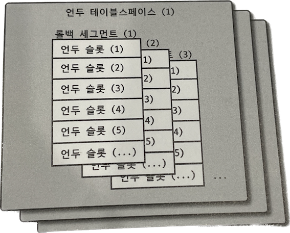

## 언두 로그란?

> myql 8.0 기준으로 DB 에서 트랜잭션과 격리 수준을 보장하기 위해서 InnoDB 스토리지 엔진을 사용하는 방법이 있어요.

트랜잭션과 격리 수준을 보장하기 위해서 DML(INSERT, UPDATE, DELETE) 로 변경 요청이 들어오면 변경전, **이전 버전의 데이터를 언두로그라는 공간에 백업해요.**

### 트랜잭션 보장

트랜잭션이 롤백되면, `도중에 변경된 데이터를 변경 전 데이터로 복구`해야 하는데, 이때 언두 로그에 백업해둔 이전 버전의 데이터를 이용해 복구해요.

### 격리 수준 보장

특정 커넥션에서 `데이터를 변경하는 도중`에 `다른 커넥션`에서 데이터를 조회하면 트랜잭션 격리 수준에 맞게 변경중인 레코드를 읽지 않고 `언두로그에 백업해둔 데이터를 읽어서 반환` 하기도 합니다.  (READ COMMITED 이상의 격리수준에서는 트랜잭션이 열려있는 데이터에 경우, 언두로그를 먼저 읽습니다.

## 언두로그 소멸 시점

그렇다면, 언두로그는 백업용 임시 공간이라는 소리인데, *언제까지 메모리에 남아있을까요?* 

 언두로그는 롤백을 하거나, 트랜잭션과 격리할 때 사용하기 때문에 트랜잭션이 종료되면 더이상 필요 없어져서  종료 되지 않을까? 추측해보았어요.

결론은 *바로 사라지진 않는다.* 입니다. 

> 트랜잭션이 완료 되었다고 해서 해당 트랜잭션이 생성한 언두로그를 즉시 삭제할 수 있는 것은 아니다. 트랜잭션이 A,B,C 가 있다고 가정하고, 서로 시작과 종료 시점이 다르게 실행 되었을 때. B,C 트랜잭션이 완료되었지만 A 트랜잭션이 아직 활성 상태에 있다면 언두로그는 계속 보존된다. ( 여기서 보존된다는 의미는 read uncommited 격리 수준 이상일 때 요청이 들어오면 언두 영역을 먼저 읽는다는 의미로 이해했습니다.)   
*개발자와 DBA를 위한 실전 가이드 RealMySql 8.0 책 p.123 에서 발췌*

삭제는 언제될까? 해당 내용은 `언두로그가 데이터를 관리하는 방식`을 알게되면 알 수 있어요.

## 언두 테이블 스페이스 관리

> 언두로그가 저장되는 공간을 언두 테이블 스페이스(Undo Tablespace)

우선 언두 테이블 스페이스가 대략 얼마나 메모리를 차지하는지 이해하기 위해서 테이블 스페이스를 관리하는 방법에 대해서 간단히 설명하겠습니다.

*하나의 트랜잭션이 필요로 하는 언두 슬롯의 개수는 트랜잭션이 실행하는 DML 의 개수에 따라 최대 4개까지 언두 슬롯을 사용하게 된다.  일반적으로 트랜잭션이 임시 테이블을 사용하지 않으므로 하나의 트랜잭션은 대략 2개 정도의 언두 슬롯을 필요로 한다고 가정하면 된다. 그래서 최대 동시 처리 가능한 트랜잭션의 개수는 다음 수식으로 예측 해볼 수 있다.*

> 최대 동시 트랜잭션 수 = (InnoDB 페이지 크기) / 16 * (롤백 세그먼트 개수) * (언두 테이블 스페이스 개수)

**가장 일반적인 설정인 16KB InnoDB 에서 기본 설정**(innodb_undo_tablespaces=2 , innodb_rollback segments =128) 을 사용한다고 가정했을 때, 대략 `131072` 개 정도의 트랜잭션을 동시에 처리가 할수 있어요. 

 트랜잭선 하나당 언두 테이블 스페이스가 만들어지고, 해당 공간에 데이터를 1000개 씩 적재한다고 가정하면,  엄청난 양의 메모리를 사용하겠죠? .. 🥲 똑똑한 RDBMS 는 이 문제점을 알고, 해결할 방법을 찾았습니다. 

## Undo table space truncate

> 언두 테이블 스페이스 공간을 필요한 만큼만 남기고 나머지를 운영체제로 반납하는 것을 `Undo table space truncate ` 라고 한다.

바로 특정 시점에 언두 로그 영역을 삭제하는 건데요. mysql 에서는 자동 모드와 수동 모드 두가지를 지원한다고 합니다. 

- `자동 모드`
    
    트랜잭션이 커밋되면, 더이상 언두로그에 복사된 이전 값은 불필요해집니다. InnoDB 스토리지 엔진의 퍼지 스레드(Purge Thread) 는 주기적으로 깨어나서 언두 로그 공간에서 불 필요해진 언두 로그를 삭제하는 작업을 시행하는데 이 작입을 `언두 퍼지스`라고 합니다. MySql 서버의 inndb_undo_log_truncate 시스템 변수가 ON 으로 설정되면 활성화 시킬 수 있습니다.
    

언두 퍼지스의 동작 원리가 궁금하시다면 [공식 문서](https://dev.mysql.com/doc/refman/8.0/en/innodb-purge-configuration.html)를 읽어보세요 ☺️

- `수동 모드`
    
    시스템 변수가 OFF 라서 언두 로그 파일의 잘라내기가 자동으로 되지 않거나 반납이 부진할 때, 언두 테이블 스페이스를 비활성화해서 언두 테이블이 더이상 사용되지 않도록 설정하면 퍼지 스레드는 비활성 상태의 언두 테이블 스페이스를 찾아서 공간을 반납한다. 반납이 완료되면 다시 언두 에티블 스페이스를 활성화 시킨다. 언두 테이블 스페이스가 최소 3개 이상 되야 수동모드를 작동할 수 있다. 
    

## 체인지 버퍼 (Change Buffer)

> RDBMS에서 레코드가 INSERT 되거나 UPDATE 될 때 해당 테이블에 포함된 인덱스도 업데이트 하는 작업이 필요합니다. 인덱싱 작업은 랜덤하게 디스크를 읽는 작업이 필요하므로 테이블에 인덱스가 많다면 이 작업은 상당히 많은 자원을 소모하게 되겠죠 ?  그래서 InnoDB 는 변경해야할 인덱스 페이지가 버퍼 풀에 있으면 바로 업데이트를 수행하지만, 그렇지 않고 디스크로부터 읽어와야한다면 임시 공간에 저장해두고 사용자에게 바로 반환해서 성능을 향상시켜요. 이때 사용하는 임시 공간이 체인지 버퍼라고 합니다. ☺️

## 리두 로그 간단히 알기

> 리두 로그(Redo Log)는 트랜잭션의 4가지 요소인 ACID 중 Durable 에 해당하는 영속성과 가장 밀접하게 연관돼 있어요.    p.131

### 리두 로그

하드웨어나 소프트웨어 등 여러가지 문제점으로 인해 mysql 서버가 비정상적으로 종료 되었을 때, 데이터 파일에 기록되지 못한 데이터를 잃지 않게 해주는 안정장치를 말해요. 체인지 버퍼에서 임시 공간에 저장된 친구들을 리두로그에 먼저 기록해두어서 비정상으로 서버가 종료되면 복구할 때 사용하는 기능이 `리두 로그` 랍니다. 

## 느낀점

트랜잭션 격리 레벨을 학습하다가 InnoDB 까지 오게 되었는데 격리 레벨을 보장하기 위해서 언두로그를 사용한다고 해서 학습을 하게 되었어요. 언두로그의 생명주기를 알게되니 격리 레벨을 이해하는데 훨씬 도움이 될 것 같습니다. 

## 참고자료

- [Real MySQL](http://www.yes24.com/Product/Goods/6960931)
- [MySQL 8.0 공식 문서](https://dev.mysql.com/doc/refman/8.0/en/innodb-purge-configuration.html)